# TankBot

**A robot platform that scales with what you plug into it, and to whatever size you build it.**

Start with an ESP32, a motor driver and a chassis, and you have a robot you can drive from a browser.
Add a bumper and distance sensors, and it protects itself. Put a phone on it, and the phone becomes its
brain. Add a lidar, and it maps your house, keeps the map straight, drives itself to wherever you tap,
and explores rooms it hasn't seen yet, all on hardware you probably already own.

<table align="center"><tr>
<td align="center">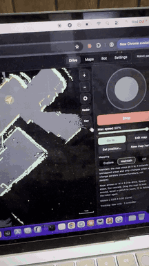<br><em>In action</em></td>
<td align="center">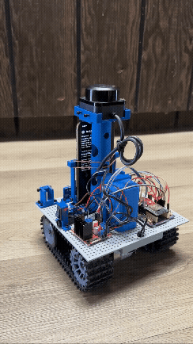<br><em>Driving</em></td>
<td align="center">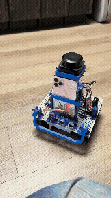<br><em>Bumper reflex</em></td>
</tr></table>

TankBot grew out of the original [TankBot ESP32](https://github.com/johnsonfarmsus/tank-bot-esp32), a
web-controlled tracked robot. This project turns it into a platform: the same software for any robot
you build on it.

## One platform, any robot, any size

Nothing in TankBot is written for one particular robot. Each robot is **described** in its *bot
profile*: how big it is, how it drives, and where every sensor sits and how high. Everything else works
from that description:

- **Planning and safety use the robot's real footprint.** Routes keep its body (plus the clearance you
  choose) away from walls; the "is it clear ahead?" check uses its actual front edge and width.
- **Sensors are placed, not hard-coded.** Any number of bumpers, ultrasonic and ToF sensors, in any
  direction, each with a role (obstacle, cliff, bump). The robot reacts in the direction each one faces.
  The lidar and camera positions turn their readings into the robot's frame.
- **Driving adapts to the machine:** minimum and cruise power, steering trim, stop and pass distances,
  turn behaviour.
- **Maps are in metres, not robot sizes:** 5 cm cells, room for a whole house (up to 40 m across).
- **Brains are interchangeable.** Any iPhone with ARKit can be the brain (tested: SE 2nd gen, 11 Pro,
  12 Pro; a LiDAR iPhone adds a depth camera), mounted on the robot or held in hand. The robot itself keeps its settings, sensors and a
  compact copy of its map, so a new phone picks everything up when it connects.

| | TankBot (today) | Wheelchair base (next) | Yours |
|---|---|---|---|
| Size | 18.5 x 17 cm platform | wheelchair-sized | describe it in the profile |
| Drive | tank tracks | two powered wheels + casters | tank or two-wheel (mecanum planned) |
| Brain | iPhone on a 3D-printed tower | a phone on the chassis | any ARKit iPhone, mounted or in hand |
| Sensors | lidar, front bumper, ultrasonic | lidar, bumpers, rangers all round | whatever you attach, wherever it sits |
| Software changes | | none planned: a new profile | none: a new profile |

The **capability tiers** below grow with the hardware: every part you add unlocks more, and the app
shows what the next part would unlock.

## Build one

### Parts list

**Electronics**

| Part | Qty | Used for | Notes |
|---|---|---|---|
| **ESP32 DevKit**, 38-pin (CP2102, USB-C) | 1 | the robot's controller | |
| **ESP32 38-pin expansion board** ("ESP32S 38P V4" style) | 1 | mounts the ESP32; power and wiring | DC input 6.5-16 V, onboard 5 V and 3.3 V, an S/V/G header for every pin (a jumper sets V to 3.3 V or 5 V). Also powers the lidar (5 V) |
| **L298N** H-bridge motor driver | 1 | drives both tracks | remove the ENA / ENB jumpers so the ESP32 controls speed |
| **TP101 tracked chassis** with 2x **33GB-520-18.7F** DC motors | 1 | the robot base | |
| **12 V Li-ion battery pack**, 3S (11.1 V, 9-12.6 V), ~5600 mAh, 5 A | 1 | power | we use a Mspalocell XZ01 kit: it comes with a 12.6 V 1 A charger, bare leads, a DC barrel connector, lever connectors and barrel-to-screw-terminal adapters, which cover all the power wiring |
| **Mini rocker switch**, SPST on/off, 2-pin pre-wired (KCD1-101 type) | 1 | main power switch | fits the printed charger clamp with switch; sold in packs (e.g. AKVIBG 10-pack) |
| **Dupont jumper wires** (female-female and male-female) | a pack | every signal and sensor connection | the expansion board's S/V/G headers take standard Dupont plugs |

**Sensors**

| Part | Qty | Used for | Notes |
|---|---|---|---|
| **Slamtec RPLidar C1** | 1 | mapping, position, navigation | on the printed lidar tower; 5 V from the expansion board |
| **HC-SR04P** ultrasonic (wide-voltage 3-5.5 V) | 1 | low obstacles ahead | powered from 3.3 V so its echo is safe for the ESP32 |
| **V-153-1C25** micro switch | 1 | front bumper | behind the printed bumper bar |
| *Optional:* **TOFSense-F2 Mini** ToF sensor | 1 | cliff (drop-off) sensor, aimed at the floor | JST GH 1.25 mm connector |

**Brain**

| Part | Qty | Used for | Notes |
|---|---|---|---|
| **An iPhone with ARKit** | 1 | the brain | tested: SE (2nd gen), 11 Pro, 12 Pro; a LiDAR iPhone adds the depth camera. It runs on its own battery |

**Hardware**

| Part | Qty | Used for | Notes |
|---|---|---|---|
| **M3 x 6 mm socket head cap screws** | a pack (a full build uses under 50) | everything | the only fastener: every printed part, board and module mounts with these |
| [**3D-printed parts**](https://www.printables.com/model/1869360-tankbot) | 1 set | tower, mounts, clamps, bumper | on Printables |

**Recommended upgrade:** a **12 V to 5 V buck converter** (2 A or more) for the 5 V rail. The expansion
board's onboard 5 V is a small linear regulator that runs hot feeding the lidar and the ESP32 from a 12 V
battery; a buck converter runs cool. It is also what you would need to charge the phone from the robot,
though the battery above is better kept for driving.

### Build steps

1. **Print the parts** from [Printables](https://www.printables.com/model/1869360-tankbot) (base plate,
   lidar tower and base, phone base and clamp, bumper and switch mount, two-part ultrasonic mount, battery
   and charger clamps, a 2-wire connector, wire management, spacers). If Printables is ever unavailable,
   a backup zip of the model files is in [`hardware/`](hardware).
2. **Assemble** the chassis and mount the printed parts, the boards and the sensors, all with M3 x 6 mm
   screws. The printed spacers sit between each board and the base to lift it off.
3. **Wire it** following [docs/wiring.md](docs/wiring.md): battery through the rocker switch to the
   expansion board and the L298N, then the motors, lidar, ultrasonic and bumper with Dupont wires.
4. **Flash and set it up** following *Setting up a robot* below.

<p align="center">
<a href="docs/images/tankbot-01.jpg">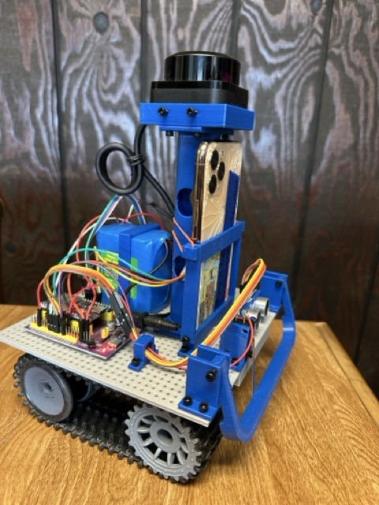</a>
<a href="docs/images/tankbot-02.jpg">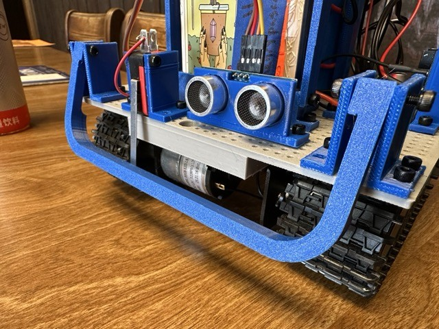</a>
<a href="docs/images/tankbot-03.jpg">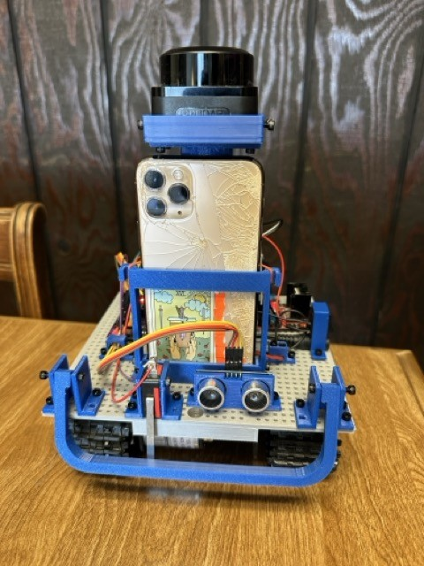</a>
<a href="docs/images/tankbot-04.jpg">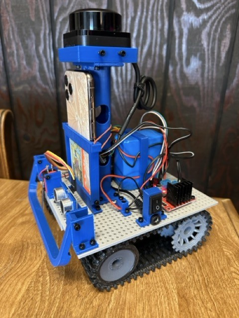</a>
<a href="docs/images/tankbot-05.jpg">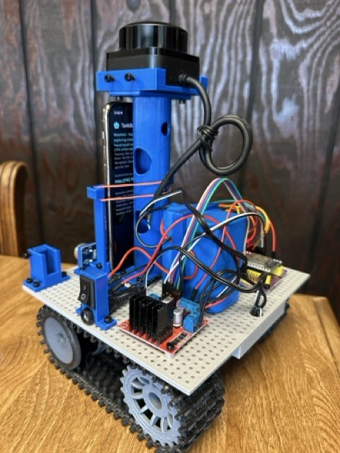</a>
<a href="docs/images/tankbot-06.jpg">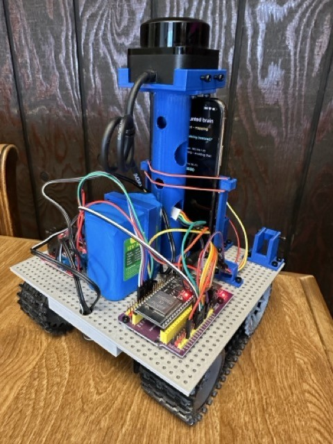</a>
<a href="docs/images/tankbot-07.jpg">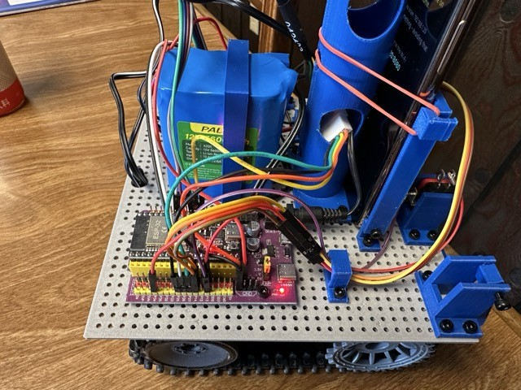</a>
<a href="docs/images/tankbot-08.jpg">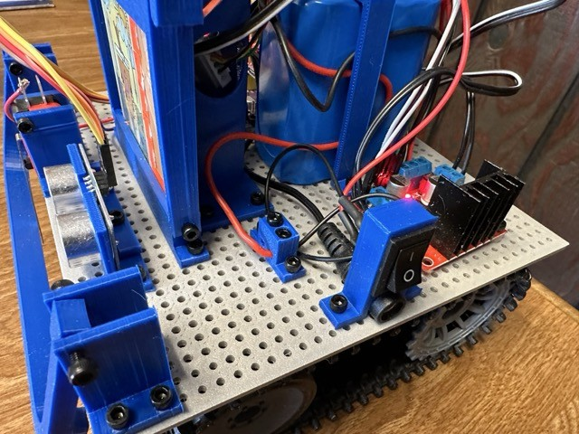</a>
<a href="docs/images/tankbot-09.jpg">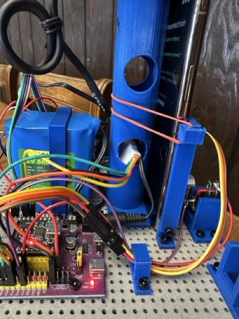</a>
<a href="docs/images/tankbot-10.jpg">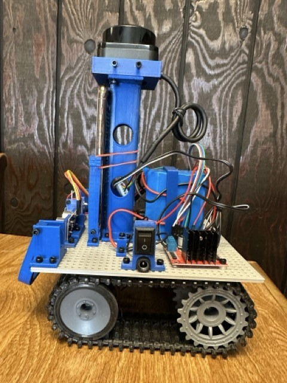</a>
<a href="docs/images/tankbot-11.jpg">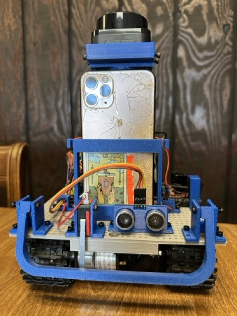</a>
<a href="docs/images/tankbot-12.jpg">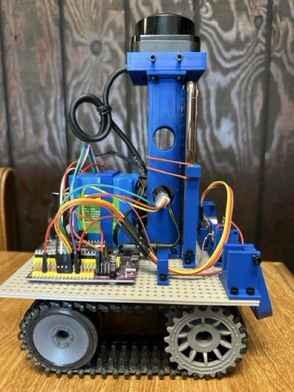</a>
<a href="docs/images/tankbot-13.jpg">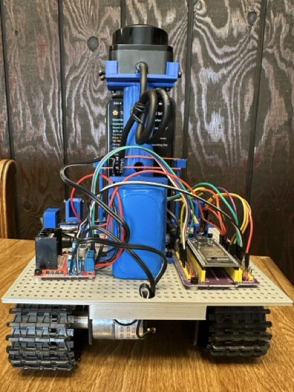</a>
</p>

TankBot grew out of the original [TankBot ESP32](https://github.com/johnsonfarmsus/tank-bot-esp32)
(a browser-driven tracked robot, with its own [Printables parts](https://www.printables.com/model/1516204-tank-bot-esp32)).
Building something bigger? The same steps apply: a motor driver that suits your motors, the sensors you
want where you want them, and a profile that describes it.

## How it fits together

```
 Robot (ESP32)                         Brain (phone/tablet running the app)         Controllers
 motors + watchdog                 --->  tracking: camera + lidar scan matching  <---  web browser
 reflexes: bumper / cliff / range        map: keyframes, loop closing, edits           (any laptop)
 lidar bridge                            guardian: is forward clear, and why?    <---  the app in
 sensor feed + capability announce       navigator: plan a route, drive it             Controller role
 own web page (drive + setup)            control server (web pages + live data)
```

Every part reads the robot's geometry from a **bot profile** (size, drive type, where each sensor
sits). Nothing about a specific robot is hard-coded.

## Capability tiers

| Tier | Hardware | You get |
|---|---|---|
| Drive | ESP32 + motor driver + chassis | manual driving from the ESP32's own web page |
| Reflexes | + bumpers, ToF, ultrasonic | bump stop and back-off, cliff stop, close-obstacle stop, on the ESP32 itself |
| Brain | + a phone or tablet running the app | full controller, position tracking (mounted), the robot's status face |
| Mapping | + RPLidar | maps, remembering places, relocalisation, tap-to-go |
| 3D awareness | + a phone with a depth camera (LiDAR iPhone) | low obstacles and drop-offs the lidar can't see |

The controller's Settings page shows the current tier and what would unlock the next.

## Repository layout

| Folder | Contents |
|---|---|
| `firmware/tankbot/` | ESP32 firmware v3: sensor table, directional reflexes, lidar bridge, sensor feed, web page, OTA |
| `firmware/motion/` | the original TankBot firmware, kept for reference |
| `app/tankbot_brain/` | the **TankBot** app (Flutter): Mounted brain / Brain in hand / Controller roles |
| `docs/` | [user guide](docs/user-guide.md), [wiring](docs/wiring.md), [protocol](docs/protocol.md), [bot profile](docs/bot-profile.md), [app architecture](docs/app-architecture.md), [diagnostics](docs/diagnostics.md), [roadmap](docs/ROADMAP.md), [changelog](CHANGELOG.md) |
| `tools/` | desktop helpers: log analysis, brain commands, controller checks ([tools/README](tools/README.md)) |
| `hardware/` | a backup zip of the 3D-printed parts (STL + Fusion 360); get the parts from [Printables](https://www.printables.com/model/1869360-tankbot) |

## Setting up a robot

1. **Wire it** following [docs/wiring.md](docs/wiring.md). Start with the motor driver; add sensors
   any time.
2. **Flash the firmware.** Copy `firmware/tankbot/src/secrets.example.h` to `secrets.h`, enter your
   2.4 GHz Wi-Fi, an OTA password and a hotspot password, then `cd firmware/tankbot && pio run -t upload` over USB once.
   From then on `pio run -e ota -t upload` updates it over Wi-Fi.
3. **Drive it.** Open `http://tankbot.local/` on any device on your Wi-Fi (buttons, joystick, or the
   arrow keys / W A S D on a computer) (away from home the robot
   broadcasts its own `TankBot` network instead). Speed levels and steering trim live here too.
4. **Tell it what's attached.** Once a brain is running (below), the **Bot** page describes the whole
   robot: its size and drive type, and each sensor's connection, role, facing and position. Save sends
   it to the robot, which keeps it. `http://tankbot.local/setup` covers Wi-Fi, name and pins. A ToF aimed
   at the floor? Press Calibrate on its card once.

## Adding a brain

1. Install the **TankBot** app on a phone (iOS today; Android when ARCore support lands). Each time it
   opens it asks what the device is doing:
   - **Mounted brain**: the phone rides on the robot; camera tracking, mount detection, status face.
   - **Brain in hand**: same brain off the robot, tracking with the lidar alone.
   - **Controller**: a remote for a brain on the network.
2. Open **`http://tankbot.local/brain`** in any browser on the same Wi-Fi: the robot sends you to
   wherever the brain is (bookmark it). The robot's own page (`tankbot.local`) also shows an
   "Open full controls" button whenever a brain is running. The app's Controller role works too.
3. Controller pages: **Drive** (map you can drag, zoom and pinch, follow-the-robot, a colour key,
   joystick, arrow keys, radar view, Go to... anywhere on the map, status cards with actions), **Maps**
   (save, load, edit, no-go lines, map quality), **Bot** (the profile: platform size, sensor
   positions and heights), **Settings** (trim, power levels, obstacle stop and pass distances,
   what the robot and the phone can do).

### Which phone, and mounting it

Any iPhone with ARKit works as a brain. A LiDAR iPhone (12 Pro and later Pros) adds the depth camera
(low obstacles, drop-offs); without one (e.g. iPhone SE) the brain runs one tier down and falls back to
lidar-only tracking when the camera drifts (dim rooms, plain walls).

Mount it upright or on its side (set "Brain phone mounted" on the Bot page; the screen locks to it)
with the back camera facing forward. Enter the camera's position and height in the Bot page.
In Robot mode the brain waits until the phone has sat still in its cradle for 3 s before mapping, so
handling the phone never smears a map. If the phone gets knocked, mapping pauses until it settles.

## Mapping and driving

See the [user guide](docs/user-guide.md) for every page, button and map symbol.

- **Mapping modes:** Explore (build the map deliberately), Maintain (default: grows into new areas and
  only changes for persistent changes), Off. Bumps and drop-offs are temporary unless they recur.
- **Go to...:** click anywhere on the map. It plans around walls, no-go lines and live obstacles,
  backs away and re-plans when blocked or stalled, and stands still when unsure where it is.
- **Explore on its own** (Explore mode): drives to unexplored edges room by room and comes home.
- **Set position** when it's lost; **restore points** undo bad mapping (Maps page).
- Map straightening keeps long maps square (wall alignment, loop closing, good GPS outdoors).
- Safety is layered: ESP32 watchdog -> on-board reflexes -> the brain's guardian -> the controller's
  watchdog. Autonomous driving always runs its own obstacle checks.
- Trip, position-event and sensor logs record what happened; see [diagnostics](docs/diagnostics.md).

## Developing

- Firmware: PlatformIO. `pio run -e esp32dev` builds; `pio run -e ota -t upload` deploys over Wi-Fi.
- App: Flutter 3.32+. `flutter test` runs the mapping, matching, planning, guardian, pose graph and
  exploration tests (must pass before every install);
  `flutter build ios` / Xcode for the phone.
- The wire protocols are in [docs/protocol.md](docs/protocol.md); `tools/lidar_client.py` is a
  minimal reference client.

## Security and privacy

For a trusted home network: the robot's and brain's controls have no login, so never expose them to
the internet. Everything the app collects stays on your devices. Details, and the pre-commit secret
check (`git config core.hooksPath .githooks`), in [SECURITY.md](SECURITY.md).

## License

GNU AGPL 3.0 (inherited from tank-bot-esp32).
